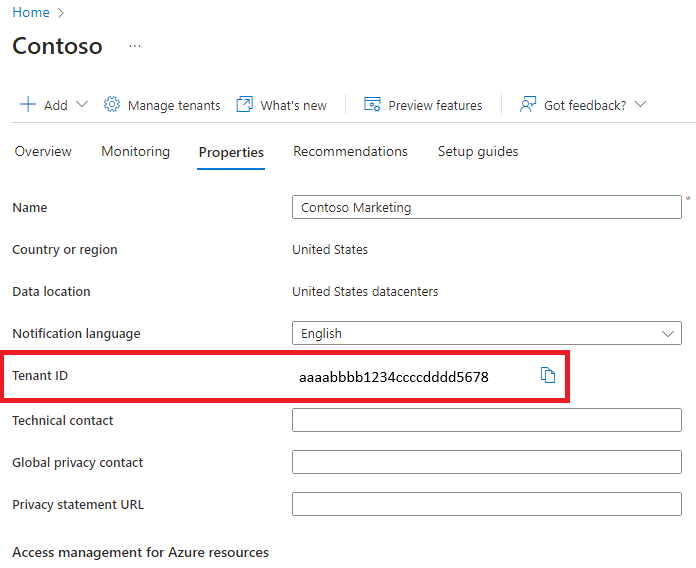

---
lab:
    title: '02 - Working with Tenant Properties'
    learning path: '01'
    module: 'Module 01 - Implement an Identity Management Solution'
---

# Lab 02: Working with tenant properties

### Login type = Microsoft 365 + E5 tenant log-in

## Lab scenario

You need to identify and update the different properties associated with your tenant.

#### Estimated time: 15 minutes

### Exercise 1 - Create a custom subdomains 

#### Task 1 - Create a custom subdomain name

You would use Microsoft Entra ID to create a domain that you have purchased.  If you want to create a subdomain to divide your existing .onmicrosoft.com domain, you have to use the Microsoft 365 admin center.

1. Browse to the [https://entra.microsoft.com](https://entra.microsoft.com) and sign in using a Global administrator account for the directory.

1. In the **Identity** menu, use the **Show more** option at the bottom.

1.  Open the **Settings** menu, select **Domain names**.

1. Select **+ Add custom domain**.

1. In the **Custom domain name** field, create a custom subdomain for the lab tenant by putting **sales** in front of the **onmicrosoft.com** domain name.  The format will look similar to this:

    ```
    Sales.###onmicrosoft.com
    ```

**Note** - You will be prompted to open the Microsoft 365 Admin center to complete this action.

1. Select **Add domain** to add the subdomain.

1. Enter the subdomain name `sales.tenantname.onmicrosoft.com` into the dialog.

1. Select the **Use this domain** button at the bottom of the screen.

1. Select the **Close** button when the next screen opens up.  For the purpose of this lab we will not set up the DNS.

### Exercise 2 - Changing the tenant display name

#### Task 1 - Set the tenant name and technical contact

1. From within Microsoft Entra admin center, open the **Identity** menu.

1. In the left navigation, select **Overview** menu item, then select **Properties**.

1. Change the Tenant Properties for the **Name** and **Technical contact** in the dialog.

    | **Setting** | **Value** |
    | :--- | :--- |
    | Name | Contoso Marketing |
    | Technical contact | `your Global admin account` |

1. Select **Save** to update the tenant properties.

   **You will notice the name change immediately upon completion of the save.**

#### Task 2 - Review the Country or region and other values associated with your tenant

1. In the **Identity** menu, select **Overview**, then select **Properties**.

2. Under **Tenant properties**, locate **Country or region** and review the information.

    **IMPORTANT** - When the tenant is created, the Country or region are specified at that time. This setting cannot be changed later.

3. In the **Properties** page, under **Tenant properties**, locate **Location** and review the information.

    

#### Task 3 - Finding the tenant ID

Azure subscriptions have a trust relationship with Microsoft Entra ID. Microsoft Entra ID is trusted to authenticate users, services, and devices for the subscription. Each subscription has a tenant ID associated with it, and there are a few ways you can find the tenant ID for your subscription.

1. Open the Microsoft Entra admin center [https://entra.microsoft.com](https://entra.microsoft.com)

1. In the **Identity** menu, select **Overview**, then select **Properties**.

1. Under **Tenant properties**, locate **Tenant ID**. This is your unique tenant identifier.

    

### Exercise 3 - Setting your privacy information

#### Task 1 - Adding your privacy info on Microsoft Entra ID, including Global privacy contact and Privacy statement URL

Microsoft strongly recommends you add both your global privacy contact and your organization's privacy statement, so your internal employees and external guests can review your policies. Because privacy statements are uniquely created and tailored for each business, we strongly recommend you contact a lawyer for assistance.

   **NOTE** - For information about viewing or deleting personal data, see [https://docs.microsoft.com/microsoft-365/compliance/gdpr-dsr-azure](https://docs.microsoft.com/microsoft-365/compliance/gdpr-dsr-azure). For more information about GDPR, see the [https://servicetrust.microsoft.com/ViewPage/GDPRGetStarted](https://servicetrust.microsoft.com/ViewPage/GDPRGetStarted).

You add your organization's privacy information in the **Properties** area of Microsoft Entra ID. To access the Properties area and add your privacy information:

1. In the **Identity** menu, select **Overview**, then select **Properties**.

    

2. Add your privacy info for your employees:

- **Global privacy contact** - `AllanD@` **your Azure lab domain**
     - Allan Deyoung is a built-in users in your Azure lab tenant who works as an IT Admin, we will use him as the Privacy contact.
     - This person is also who Microsoft contacts if there's a data breach. If there's no person listed here, Microsoft contacts your global administrators.

- **Privacy statement URL** -  <https://github.com/MicrosoftLearning/SC-300-Identity-and-Access-Administrator/blob/master/Allfiles/Labs/Lab2/SC-300-Lab_ContosoPrivacySample.pdf>

     - In sample Privacy PDF is provided in your labs directory.
     - Type the link to your organization's document that describes how your organization handles both internal and external guest's data privacy.

    **IMPORTANT** -If you don't include either your own privacy statement or your privacy contact, your external guests will see text in the Review Permissions box that says, **<your org name\>** has not provided links to their terms for you to review. For example, a guest user will see this message when they receive an invitation to access an organization through B2B collaboration.

    

3. Select **Save**.

#### Task 2 - Check your Privacy Statement

1. Return to the Azure Home screen - Dashboard.
2. In the upper-right corner of the UI, Select on your username.
3. Choose **View account** from the dropdown menu.

     **A new browser tab will open automatically.**

4. Select the **Settings & Privacy** on the left menu.
5. Select **Privacy**.
6. Under **Organization's notice** select the **View** item next to Contoso Marketing organizational privacy statement.

     **A new browser tab will open with the Prvacy PDF file you linked to displayed.**

7. Review the sample Privacy statement.
8. Close the browser tab with the PDF in it.
9. Close the browser tab displaying the **My Account** items.
